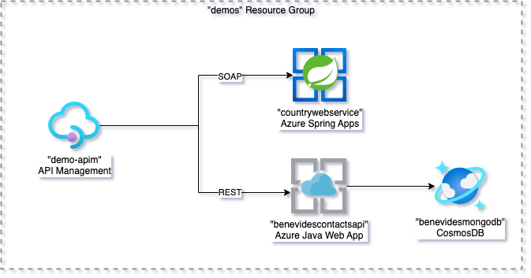

# APIM Features demo (Work in Progress)

This project demonstrate the following features of APIM

- Import REST API
- Import SOAP API
- Convert SOAP to REST
- Authentication
- Cache
- ...

The project [terraform-azure-demos](./terraform-azure-demos/) creates the following resources accoding to the diagram bellow.

- A resource group called "demos"

- A Spring Cloud Service called "myspringapps"
- A Spring Cloud App called "countrywebservice"
- A Spring Cloud Java deployment called "default"
- An App Service Plan called "benevidesappsvcplan"
- A Linux Java Web App called "benevidescontactsapi"
- A CosmosDB account called "benevidesmongodb"
- A CosmosDB database called "contacts"
- A CosmosDB collection called "contacts"
- An API Management instance called "demo-apim"

## How to use it?

1. Checkout this project 
2. Go to the folder [terraform-azure-demos](./terraform-azure-demos/) and run the following command to create the resource above:

        terraform init
        terraform apply

